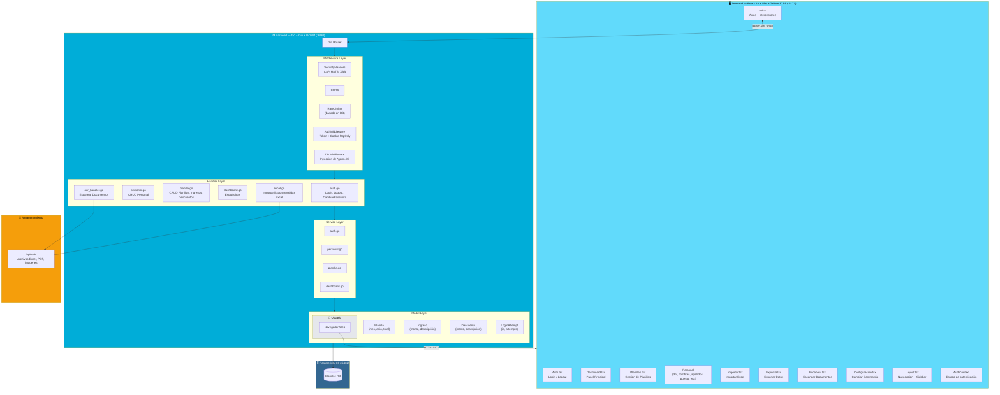
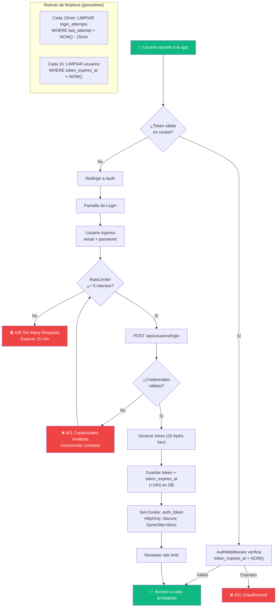
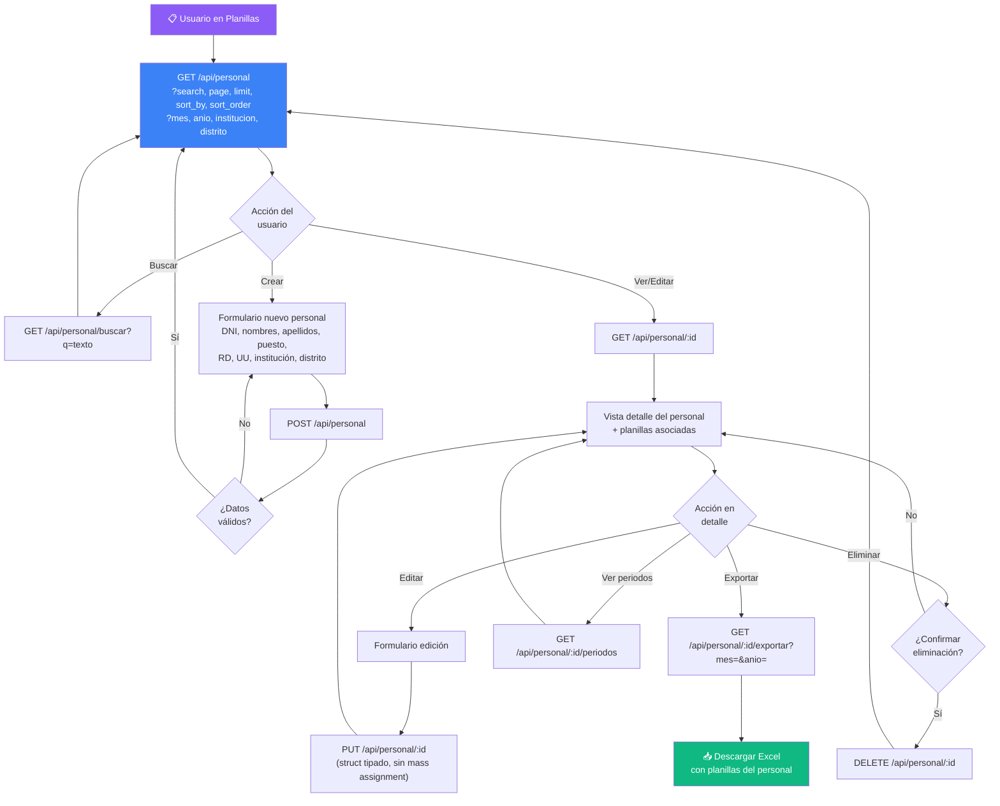
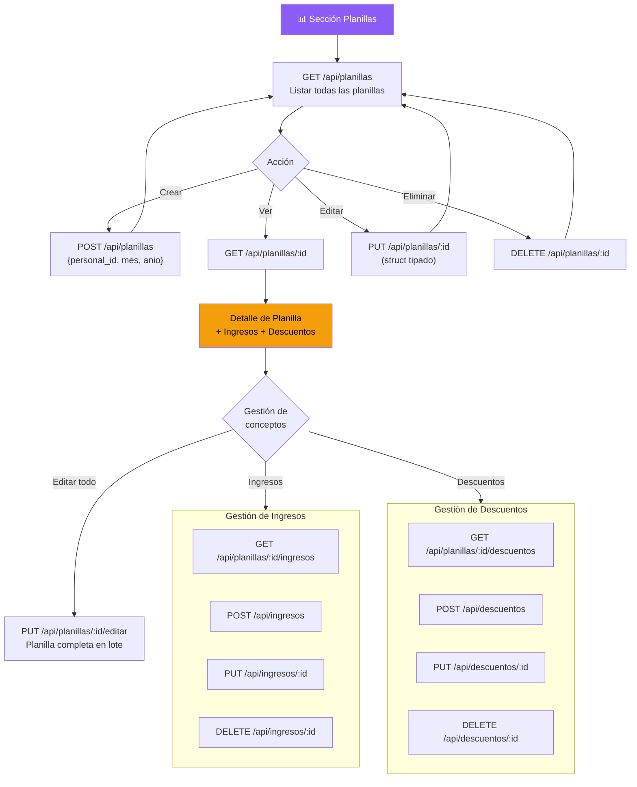
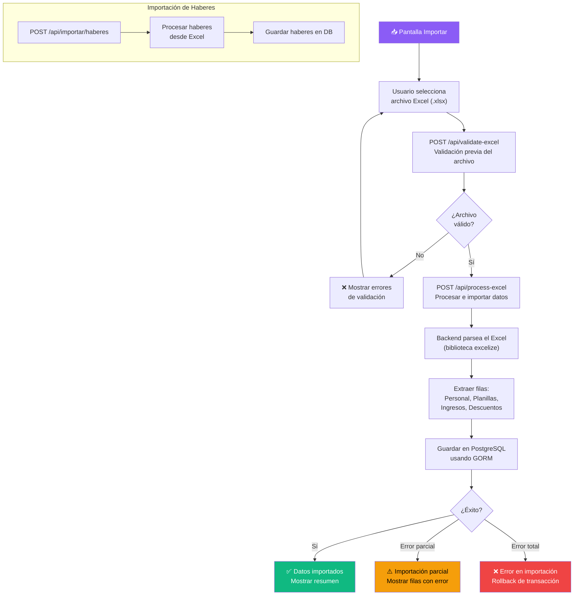
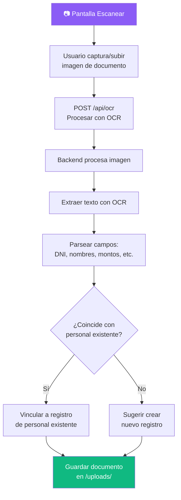
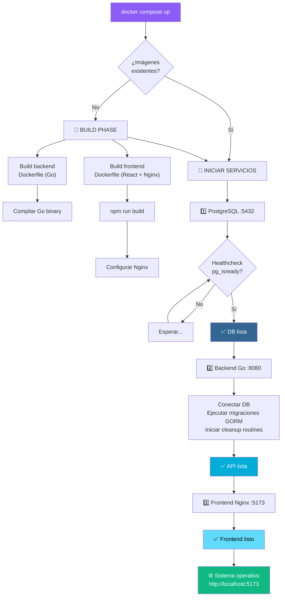
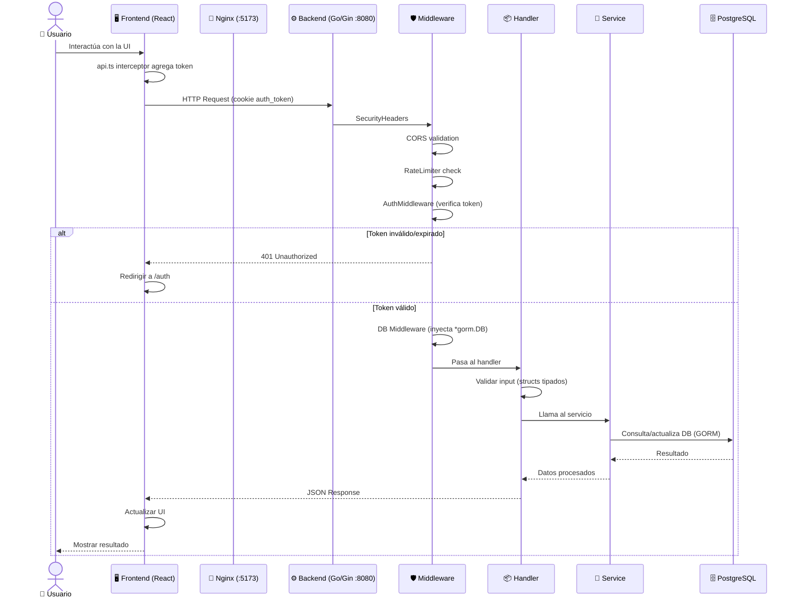
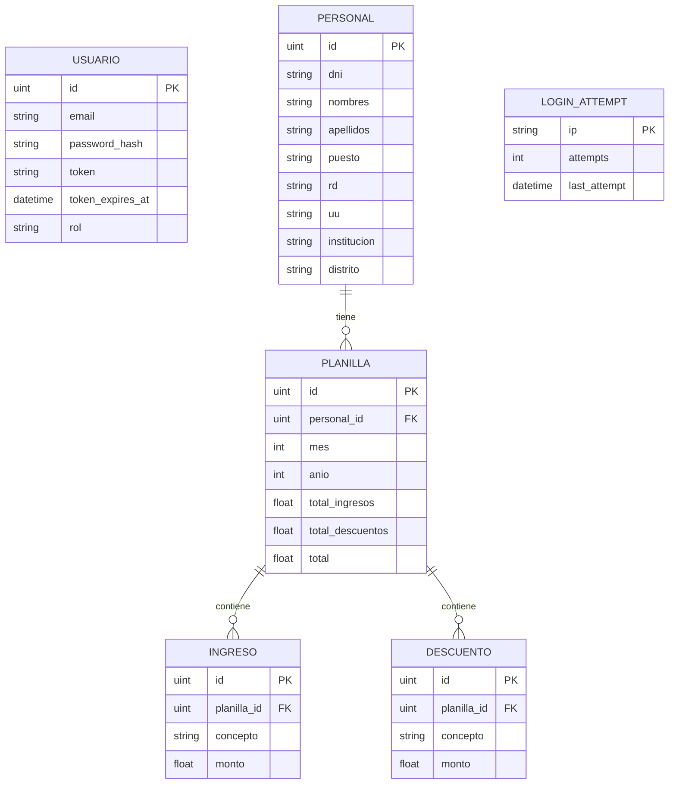

# Diagrama de Flujo — Sistema de Gestión de Planillas SU

## 1. Arquitectura General del Sistema

## 2. Flujo de Autenticación

## 3. Flujo de Gestión de Personal

## 4. Flujo de Gestión de Planillas

## 5. Flujo de Importación Excel

## 6. Flujo de Escaneo OCR

## 7. Flujo de Despliegue (Docker Compose)

## 8. Flujo Completo de Solicitud HTTP

## Resumen de Entidades y Relaciones

---

> **Nota**: Este diagrama refleja la arquitectura refactorizada con separación de capas (Handler → Service → Model), middleware de seguridad (RateLimiter basado en DB, httpOnly cookies, security headers), y structs tipados para prevenir Mass Assignment.
